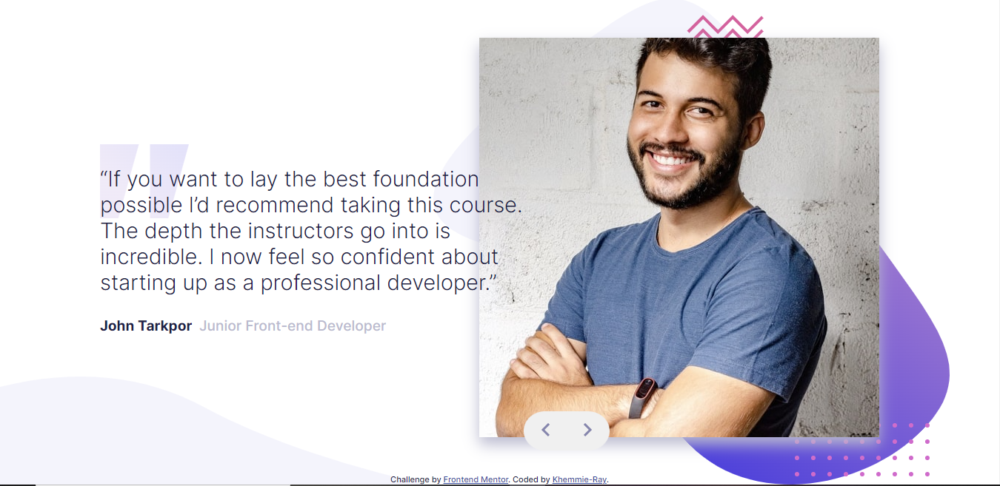
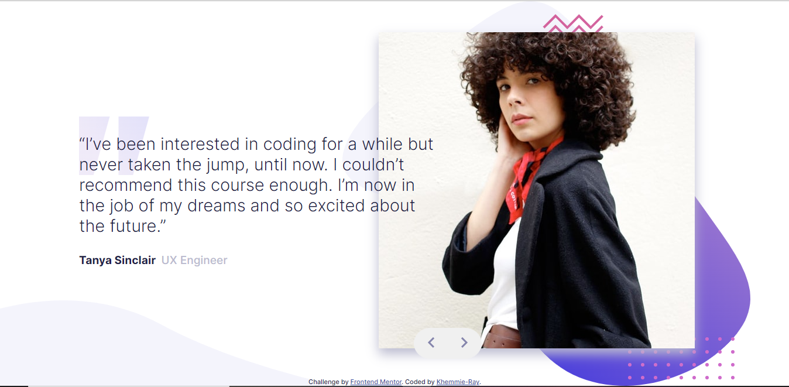

# Frontend Mentor - Coding bootcamp testimonials slider solution

This is a solution to the [Coding bootcamp testimonials slider challenge on Frontend Mentor](https://www.frontendmentor.io/challenges/coding-bootcamp-testimonials-slider-4FNyLA8JL). Frontend Mentor challenges help you improve your coding skills by building realistic projects. 

## Table of contents

- [Overview](#overview)
  - [The challenge](#the-challenge)
  - [Screenshot](#screenshot)
  - [Links](#links)
- [My process](#my-process)
  - [Built with](#built-with)
- [Author](#author)

## Overview

### The challenge

Users should be able to:

- View the optimal layout for the component depending on their device's screen size
- Navigate the slider using either their mouse/trackpad or keyboard

### Screenshot

### Links

- Solution URL: [https://github.com/Khemmie-Ray/Coding-Bootcamp-Testimonial-Slider.git](https://github.com/Khemmie-Ray/Coding-Bootcamp-Testimonial-Slider.git)
- Live Site URL: [https://coding-bootcamp-testimonial-slide.netlify.app/](https://coding-bootcamp-testimonial-slide.netlify.app/)

## My process

### Built with

- Semantic HTML5 markup
- CSS flex
- React Hooks
- [React](https://reactjs.org/) - JS library

## Author

- Website - [Oluwakemi Atoyebi](https://oluwakemi-atoyebi-portfolio.netlify.app/)
- Frontend Mentor - [@Khemmie-Ray](https://www.frontendmentor.io/profile/Khemmie-Ray)
- Twitter - [@Haramide](https://www.twitter.com/haramide)
